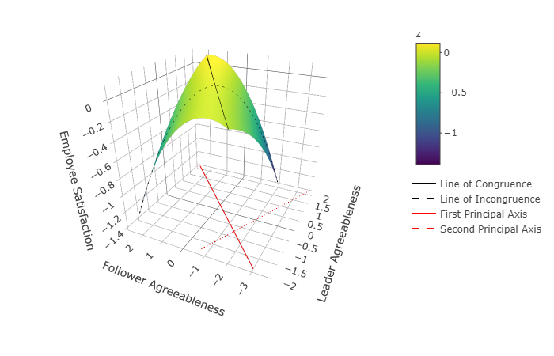

```{r setup, include=FALSE}
knitr::opts_chunk$set(echo = TRUE)
```


`rrs` is an R package intended to help researchers conduct response surface analysis. While our primary motivation was to create a package that uses cluster robust standard errors, analysts will find that the package can accommodate non-clustered data as well as data that exhibits heteroskedasticty. The workhorse of this package is `resp_surf` which conducts response surface analysis. There are, however, several helper function that facilitate response surface analysis. For example, `gen_response_surf_x()` and `gen_response_surf_y()` simulate response surface data and are useful when formulating hypotheses and conducting power analysis. `plot_ly_surf()` generates interactive plots and through which the user can create still .png files. Users are invited to explore the documentation and watch this repository for future developments, including a dedicated wrapper for calculating power. 

## Installation

To install `rss` run the following code. 

```{r, eval = FALSE}
devtools::install_github("jimmyrigby94/rrs")
```

## A Few Quick Examples

### Simulation

Simulation of response surface models requires a few things. First, users must provide the covariance matrix of the two focal variables. Second, users must provide the regression coefficients associated with the linear, quadratic, and interaction terms within the polynomial model. Third, the user must provide the number of observations they would like to simulate. Finally, the user needs to provide the residual variance of the outcome variable. 

This final step causes problems for polynomial regression, especially when the user has an idea of what the total variance of the outcome variable should be. The issue stems from the calculation of the variance of the product of two variables, which doesn't have a closed form solution in the general case. To sidestep this issue and provide users control of the variance of simulated variables, we capitalized on the algebra of random variables and regression model assumptions. The regression model assumes that 

$var(y) = var(\hat{y} + \epsilon)$

Expanding this term we get


$var(y) = var(\hat{y}) + var(\epsilon) + 2\ cov(\hat{y}, \epsilon)$

Given our model's assumptions, we can set $cov(\hat{y}, \epsilon)$ to 0. Which leaves us with the fact that 

$var(y) = var(\hat{y}) + var(\epsilon)$

$var(\hat{y})$ is given exclusively by the regression weights and covariances provided by the user. Thus, we can solve for the error variance of a model by providing the desired variance of y and subtracting the variance of the predicted value. 

$var(y) - var(\hat y)$

`find_sig()` does just that, except it does it for large data sets thousands of times. This allows us to be exceptionally precise in our specifications of error variance when conducting simulations. 


Let's say a user wants to simulate a fully standardized response surface, meaning that all independent and dependent variables have a variance equal to 1. Furthermore, let's say that the user wants the independent variables to be uncorrelated and the underlying regression model should be 

$y = 0\ X_1+0\ X_2+-.075\ X_1^2+-.075\ X_2^2+.15\ X_1X_2$
This is easily done using `rrs`. 

```{r, message=FALSE}
# Setting Seed for replicability
set.seed(9999)

# Importing for magrittr pipe (%>%)
library(tidyverse)
library(rrs)

# Defining Necessary Parameters ------------------------------------------
# Defining Correlation Matrix describing how x1 and x2 are related
# Covarince and variance of x1^2, x2^2, and x1*x2 follow from this matrix
cov_mat<-matrix(c(1, 0,
                  0, 1), byrow = TRUE, 2, 2)

# Defining betas x1, x2, x1^2, x2^2, and x1*x2
beta<-c(0, 0, -.075, -.075, .15)

# Solving for the Error Variance -----------------------------------------
# Simulating 10,000 draws of size 10000 assuming the correlation structure and regression weights defined above.
sig_hat <- find_sig(n = 10000, cov_mat = cov_mat, beta = beta, target_var_y = 1)

# Simulating Data
simmed_df<-gen_response_surf_x(1000, cov_mat, x_names = c("L_Agree", "F_Agree"))%>%
  gen_response_surf_y(beta = beta, sigma = sig_hat, y_name = "Satisfaction")

# Sample variance approaches the target variance. 
var(simmed_df$Satisfaction)
```

### Response Surface Analysis

Let's fit a model using the simulated data. This can be done using `resp_surf()`. 

```{r}
model_1<-resp_surf(dep_var = "Satisfaction", 
                   fit_var = c("L_Agree", "F_Agree"), 
                   data = simmed_df, 
                   robust = FALSE)
```

The output tells us how many people were approximately congruent, and of the people who were in-congruent, how many exhibited a surplus or a deficit. 

```{r}
model_1$dif_tab
```

The output also provides estimates for the regression weights, lines of interest, stationary points, and principle axes. 
```{r}
model_1$results
model_1$loi
model_1$stat_pnt
model_1$princ_axis

```

## Plotting Functions
Finally, this can all be plotted using a wrapper that builds the response surface plot in an interactive fashion. While the interactive version of this document cannot be displayed in the README here is a still shot taken from the function output. 
```{r, eval = FALSE}
plot_ly_surf(obj = model_1, 
             max_x = 2, 
             min_x = -2,
             max_y =  2, 
             min_y = -2, 
             inc = .1, 
             x1_lab = "Leader Agreeableness", 
             x2_lab = "Follower Agreeableness", 
             y_lab = "Employee Satisfaction", 
             showscale = TRUE)
```
